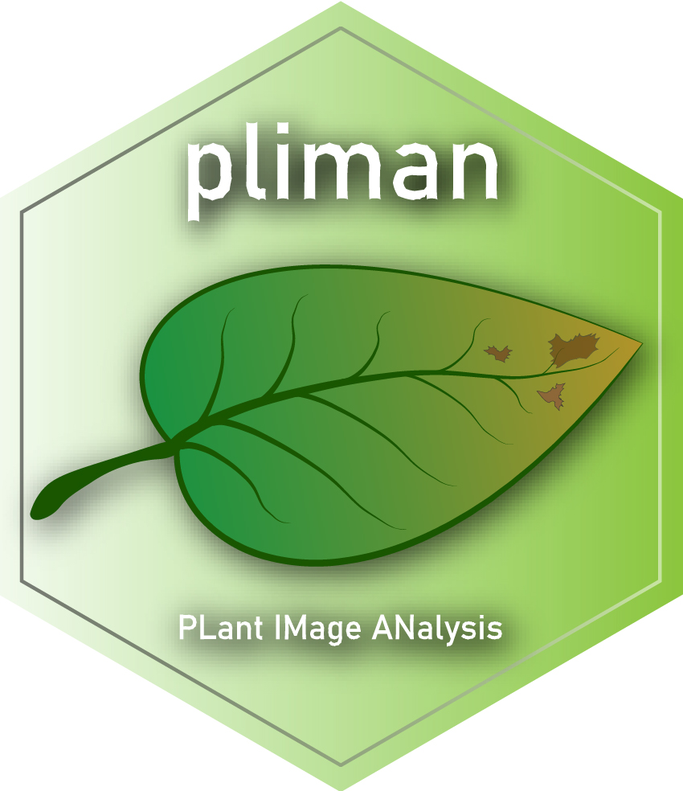

% About
# <i class="fas fa-glasses"></i>About
In this website are available the codes used to reproduce the analysis and results of the paper describing the pliman R package

  `pliman` (**pl**ant **im**age **an**alysis) is designed to analyze plant images, especially related to leaf and grains.  The package will help you to:

* Measure leaf area;
* Measure disease severity;
* Count the number of lesions;
* Obtain the shape of lesions;
* Produce Standard Area Diagrams;
* Count objects in an image;
* Get object features (area, perimeter, radius, circularity, eccentricity, solidity);
* Get the RGB values for each object in an image;
* Get the object coordinates;
* Get the object contours;
* Get convex hulls;
* Isolate objects;
* Plot object measures.

`pliman` also provides useful functions for [operation](https://tiagoolivoto.github.io/pliman/reference/image_combine.html), [transformation](https://tiagoolivoto.github.io/pliman/reference/utils_transform.html), and [segmentation](https://tiagoolivoto.github.io/pliman/reference/image_binary.html) of images. Please, visit the [Examples](https://tiagoolivoto.github.io/pliman/index.html) page in `pliman` website for a detailed documentation of each function.


# <i class="fas fa-code"></i>How to reproduce?

* Download data

To download the files and code needed for reproducing the results, first clone the project with

```{r eval = FALSE}
git clone https://github.com/TiagoOlivoto/paper_pliman.git
```


An alternative way is by downloading the [ZIP file](https://github.com/TiagoOlivoto/paper_pliman/archive/refs/heads/master.zip) containing the scripts and all needed images (~365 MB)

* Reproducing
   - Open the `code.Rmd` file in RStudio.
   - Optionally change functions and arguments.
   - Knit the document to see the results.

<!-- inicio academic icons -->
<link rel="stylesheet" href="https://cdn.jsdelivr.net/gh/jpswalsh/academicons@1/css/academicons.min.css">
<!-- final academic icons -->
<!-- inicio font awesome -->
<script src="https://kit.fontawesome.com/1f72d6921a.js" crossorigin="anonymous"></script>


# <i class="fas fa-scroll"></i> Take a look!

The following talk (Portuguese language) was ministered to attend the invitation of the President of the Brazilian Region of the International Biometric Society (RBras).

<iframe width="760" height="430" src="https://www.youtube.com/embed/ElvUVlPocgA" title="YouTube video player" frameborder="0" allow="accelerometer; autoplay; clipboard-write; encrypted-media; gyroscope; picture-in-picture" allowfullscreen></iframe>